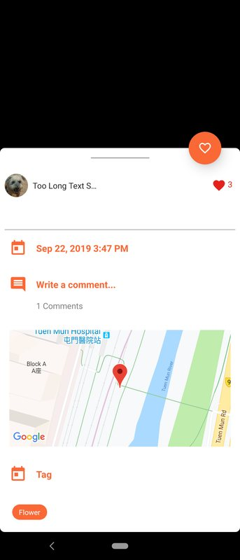
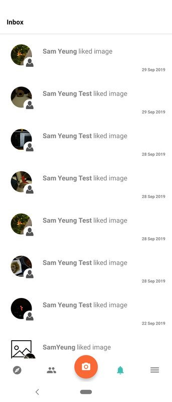
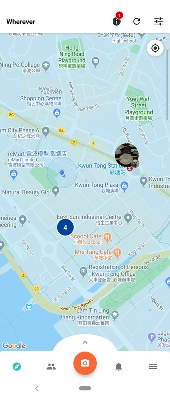
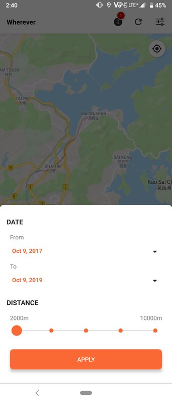
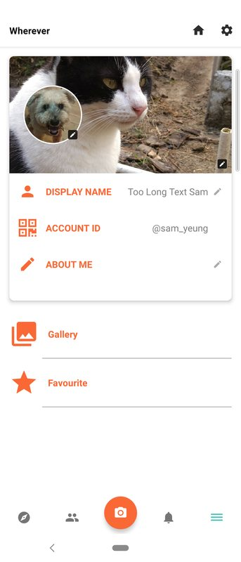

# Wherever Mobile App 
- Author: Sam Yeung
- Date: 3 Oct, 2022
---

A location-based social interaction platform designed to share updates, interact with posts, and explore nearby places. The app integrates Google Maps and offers a smooth and user-friendly experience.

---

## Features

### 📝 Post Creation and Interaction
- Create posts with **timestamps**, **comments**, and **location tags**.
- Like and comment on posts to engage with others.
- Google Maps integration for tagging and visualizing locations.

### 🔔 Notifications
- A dedicated **inbox** displays activity notifications (e.g., "liked image").
- Notifications are sorted chronologically and include timestamps.

### 🗺️ Map Integration
- Explore nearby places and interact with content via Google Maps.
- View your location and tagged posts directly on the map.

### 🔎 Search and Filter
- Filter posts by **date range** or **distance** (from 2,000m to 10,000m).
- Customize your search criteria easily with a slider.

### 👤 User Profile
- Personalize your profile with a **display name**, **account ID**, and **About Me** section.
- Upload profile pictures and manage your **gallery** and **favorites**.

### 📱 Intuitive Navigation
- A bottom navigation bar provides quick access to:
    - Home
    - Map
    - Notifications
    - User Profile

---

## Screenshots
### Post Interaction

### Notifications

### Map Integration

### Filters

### User Profile

---

## Tech Stack
- **Frontend**: Android (Kotlin), Rxkotlin
- **Maps Integration**: Google Maps API
- **Backend**: https://github.com/SamYeung1/wherever-app-server
---
